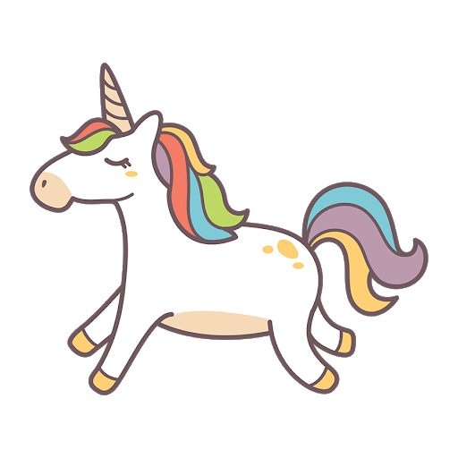

```{css, echo=FALSE, purl = FALSE}
.title-slide {
  background-image: url(assets/img_l4/lm_with_unicorn.jpg);
}
```

```{r setup, include=FALSE, purl = FALSE}
knitr::opts_chunk$set(
  echo = TRUE,
  message = FALSE,
  warning = FALSE,
  fig.align = "center",
  dpi = 100,
  fig.height = 4
)

# knitr::opts_hook$set(
#  purl = knitr::hook_purl
# )
```

```{r, include=FALSE}
## load packages
library(car)
library(performance)
library(lmtest)
library(DHARMa)
library(DiagrammeR)
library(tidyverse)
theme_set(theme_classic(base_size = 16))
```

```{r xaringan-panelset, echo=FALSE, purl = FALSE}
xaringanExtra::use_panelset()
xaringanExtra::use_tile_view()
```


## Why to we build models

---

```{r}
#| echo: false
grViz('
digraph {
  node[fontname = "Helvetica"]
  node[style = filled]
  layout=dot
  Z [color=pink]
  X [color=grey];
  Y [color=orange];
  Z -> {X}
  X -> Y
}'
)
```

---

### Simple linear regression

---
class:center, middle

```{r}
#| echo: false
grViz('
digraph G {
  graph [center=1 rankdir=LR size = "4!"]
  node[fontname = "Helvetica,Arial,sans-serif"]
  node[style = filled, color = grey]
  A [label = "tada" pos = "0,0!" color=pink]
  Ours[pos="0,2!"];
  fruit[pos="1,1!"];
  A -> Ours
  fruit->{A Ours}
}'
)
```

---

```{r}
library(dagitty)
library(ggdag)

bigger_dag <- dagify(y ~ x + a + b,
  x ~ a + b,
  a ~ d,
  exposure = "x",
  outcome = "y"
)

ggdag(bigger_dag) + theme_dag()
```

---
class: center

# Happy modelling


